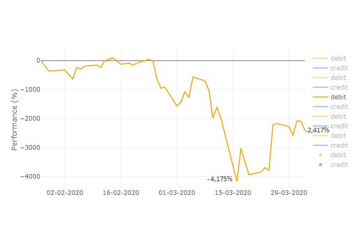

# BBVA Funds Analytics in Mexico
### Summary
This repository contains a dasboard that depicts basis points and percentage for every debit (profits), credit (losses) and balance by fund or its type in multiple scatter plots and pie charts from the BBVA Asset Management Websites on a daily basis. 
### Technical Details
In order to run the code, it is required: 
* Google Chrome, Firefox or any other Internet Explorer 
* Utilizes Python, JSON, JavaScript, Plotly, HTML. 
### Screenshots
For example, the loss of all equity instruments during coronavirus crisis is depicted as follow: 
CoronavirusCrisisInSharesMarket.jpg 
  

### Explanations 
The outcome is shown in screenshots for reference purpose of the public. 
# BBVA Funds Analytics in Mexico

The dashboard shows funds' information scraped from different websites on a chosen day. 
The scatter plot displays a profit comparison between all of them.  
A search engine breaks down every item in the database such as the most current
price obtained from the Bancomer Asset Management websites.
The pie charts depict actual profits recorded into a double entry accounting
system such as debits, credits and balances from January to April 2020. In the
dashboard, interactive scatter plots illustrate cumulative amounts in pesos, capability expenditure
in percentage and total profits per fund or type of fund (Debt or Equity Market). Tools used: Python, JSON, JavaScript,
Plotly, HTML, CSS, Flask and SQLite.
